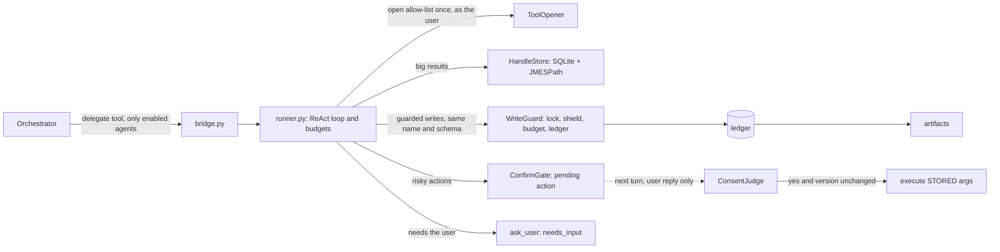

# agent-kit

A small runtime for safe, multi-step specialist agents: one folder per agent, safety enforced in code.

> A clean-room re-implementation of work I designed and built for a production
> multi-tenant AI workspace platform. No employer code; all names and data are fictional.

[](https://github.com/Tayyab-Bilal/agent-kit/actions/workflows/ci.yml)

## The problem

A chat orchestrator delegates work to "specialists" that are really one-shot LLM calls. Real tasks
(build or fix an automation, analyse a big dataset) need a multi-step agent. That brings four
problems. Big tool results flood the prompt. A timed-out or cancelled save may be lost or
duplicated. A risky action needs an **actual user "yes"**, not the model's opinion that the user
agreed. And the agent must act with the chatting user's permissions, not a shared service
identity.

This repo is a runtime that solves those once, so a new agent is a folder, not a class. The
setting is a fictional app, "Acme Workspace" (notes, tasks, documents, workflows). Two demo agents
ship: `notes_curator` (tidies notes) and `workflow_helper` (finds, checks, copies and, after the
user confirms, publishes and runs workflows).

## What it does

- **One folder = one agent.** `agent.yaml` card + `SKILL.md` + optional tools (`card.py`, `registry.py`).
- **Strict, fail-closed cards.** Unknown keys are rejected; every write tool must be guarded or
  confirm-gated; a broken card excludes only that agent (`registry.discover`).
- **Runs as the chatting user.** A `ToolOpener` opens the card's allow-list once as that user, and
  the run refuses to start if any tool is missing or forbidden (`opener.py`, `runner.run`).
- **Big results become handles.** Per-task SQLite tables; the model sees a summary and queries with
  read-only SQL or JMESPath (`handles.py`).
- **Guarded writes under the tool's own name and schema.** The model sees `save_note` exactly as
  registered; the call routes through the guard (`write_guard.py`).
- **Idempotent, shielded commits.** Same-item no-op, per-key lock, `asyncio.shield`, existence
  check after unclear errors, a ledger (`write_guard.py`).
- **Confirm-first actions.** Code-written question, stored arguments, a judge that reads only the
  user's reply, a version stamp re-check (`confirm.py`, `consent.py`).
- **Budgets.** Steps, saves, tool calls, backend calls and a deadline (`card.Budget`).
- **Asks when it must.** A built-in `ask_user` tool ends the run with `needs_input`.
- **Orchestrator bridge with per-agent flags.** One generated delegate tool; nothing enabled means
  the orchestrator's tools are byte-for-byte unchanged (`bridge.py`).
- **Reuse, not rewrite.** A pure `diagnose()` function is called directly and as a tool
  (`agents/workflow_helper/diagnose.py`).
- **Consent eval harness.** 96 consent replies and 14 same-item cases, English and Arabic, where
  one false confirm fails the build (`tests/evals/`).

## Quickstart

```bash
uv venv .venv && uv pip install -e ".[dev]"
.venv/bin/pytest -q
.venv/bin/python examples/demo.py
```

`examples/demo.py` runs both agents against a scripted fake LLM. Excerpt of its output:

```text
=== User replies: "yes but only two of them" ===
completed: Cancelled, nothing was changed: reply was not a clear yes
archived so far: []

=== workflow_helper: two workflows match 'weekly', so it asks ===
needs_input: Which one: 'Weekly report' or 'Weekly report (old)'?

=== workflow_helper: diagnose, as a tool and as a plain function call ===
risk: high; last run died on step s3
  - step s3 needs setting 'channel' but it is empty
  - step s9 can never run: nothing leads to it
  - the last run died on step s3: channel is empty

=== workflow_helper: delete is not on the card, so it is refused ===
model was told: <data source="tool:delete_workflow">error: tool 'delete_workflow' is not allowed for this agent</data>
wf-1 still exists: True
```

## Usage guide

The short version. Blocks run top to bottom and use top-level `await` (try `python -m asyncio`).
The full guide is [docs/usage.md](docs/usage.md); writing your own agent is
[docs/writing-an-agent.md](docs/writing-an-agent.md); signatures are in [docs/api.md](docs/api.md).

Load agents and run one task:

```python
from agent_kit import runner
from agent_kit.agents.notes_curator.tools import NotesBackend, build_tools
from agent_kit.confirm import ConfirmGate
from agent_kit.consent import RuleConsentJudge
from agent_kit.fakes import ScriptedLLM
from agent_kit.handles import HandleStore
from agent_kit.llm import Final, ToolCall
from agent_kit.registry import BUILTIN_AGENTS, discover
from agent_kit.write_guard import WriteGuard

backend = NotesBackend(50)
tools = build_tools(backend)
agent = discover(BUILTIN_AGENTS, tools).agents["notes_curator"]
card, gate = agent.card, ConfirmGate()
guard = WriteGuard(tools, lambda tool, key: backend.note_exists(key), card.budget)

llm = ScriptedLLM([
    [ToolCall("save_note", {"title": "Summary", "body": "All quiet."})],
    [ToolCall("archive_notes", {"ids": [1, 2]})],      # risky: stored, not executed
    Final("Waiting for your answer."),
])
asked = await runner.run(
    card, runner.Task("t1", "Summarise and archive"), llm, tools, HandleStore(), guard, gate,
    skill_text=agent.skill_text, version_of=backend.version_of,
)
print(asked.status, [a.key for a in asked.artifacts])
print(asked.message)
```

Next turn the user replies. Only the pending id and the reply go back in; the stored arguments run:

```python
done = await runner.resume(
    card, asked.pending_action.id, "yes", RuleConsentJudge(), tools, gate, guard, "t1",
    current_version=await backend.version_of("archive_notes", {}),
)
print(done.status, done.message, [n["id"] for n in backend.notes if n["archived"]])
```

To run as the chatting user, pass `opener=` and `user=` instead of `tools` (see the usage guide).

## How it works



The main flow of `runner.run`:

1. **Open.** With an opener, the card's tools are opened once as the chatting user. A missing or
   forbidden tool, or a card that breaks a rule, returns `failed` before the model is called.
2. **Expose.** Guarded tools are swapped for twins with the same name and schema that route
   through the guard. The model is shown the card's tools plus `sql_query`, `jmes_query`, `ask_user`.
3. **Loop.** Each model turn returns tool calls or a final message. For every call, code checks
   the allow-list, the tool-call and backend-call budgets and the deadline.
4. **Dispatch.** A confirm action is stored with its exact arguments and ends the run with a
   code-written question. A guarded write goes through the guard. A big list becomes a handle. Any
   tool error is an observation, not a crash.
5. **Result.** `TaskResult` has a status (`completed`, `needs_input`, `failed`), a message, and
   artifacts read from the ledger. `run` never raises.
6. **Resume.** `runner.resume` takes the pending id and the user's reply. The judge decides, the
   version stamp is compared, and the stored arguments run. Each id works once.

### The write guard

For one `(task, tool, item key)`: a per-key lock lets one save forward at a time, and a second save
of the same item returns the first result without forwarding. The forward runs as its own task
behind `asyncio.shield`, so a cancelled turn (deadline, client gone) does not abandon an in-flight
commit: it finishes and is written to the ledger, and a retry that arrives while it is still running
joins it instead of forwarding again. If a forward raises `TransportError` or `TimeoutError`, the
guard asks `exists(tool, item_key)`: if the item is there the save is recorded as recovered,
otherwise it raises `WriteRefused`. If the outcome of a cancelled commit is lost, the key stays
"uncertain" and the next save of it asks `exists` first. Other exceptions are definite failures.

This is as strong as the `exists` check. It can match an item that was already there before the task,
so a backend unique constraint or idempotency key is still the real guarantee (see Limits).

## Design decisions

1. **One folder = one agent.** Why: adding an agent is data, not code, so it cannot add new
   behaviour to the runtime. Rejected: a class per agent, which grows its own loop and its own bugs.
2. **Cards are strict and fail closed.** Why: an unknown key is almost always a typo of a safety
   setting, and a half-loaded agent is worse than none. Rejected: ignoring unknown keys; refusing
   to boot when one card is broken.
3. **The safety boundary is code, not the prompt.** Any write tool on a card must be guarded or
   confirm-gated or the card is rejected at load. Rejected: "tell the model to be careful".
4. **Run as the chatting user.** The allow-list is opened once as that user, so the backend
   enforces their permissions and a prompt trick cannot read another user's data. Rejected: one
   service identity with permission checks re-implemented inside the agent.
5. **Big results become handles.** Per-task SQLite plus JMESPath keeps the prompt small and the
   query surface tiny. Rejected: pasting rows into the prompt; a code sandbox (see
   [In production](#in-production)).
6. **Guarded writes keep the tool's own name and schema.** The model cannot "forget" to use the
   safe version, because there is no other version. Rejected: a separate `safe_save` tool; wrapping
   backend tools inside custom tools.
7. **Writes are shielded and checked, not blindly retried.** Why: a timeout does not say whether
   the write landed. Rejected: blind retry (duplicates); cancelling an in-flight commit (loses it).
8. **Consent is decided by code, never the agent model.** A risky action is stored with exact
   arguments and a code-written question; next turn a judge reads only the user's reply, then a
   version stamp is re-checked and the **stored** arguments run. Rejected: letting the model ask
   and report back what the user said.
9. **The judge is fail-closed.** Only a bare yes confirms; "yes, but ..." is unclear. An error or
   garbage cancels. Rejected: a permissive reading of "yes plus extra words".
10. **Data is not instructions.** Tool and user content is escaped as data in prompts, and a record
    name cannot forge a confirmation question. Rejected: trusting delimiters the data can close.
11. **Artifacts come from the ledger.** What the model says it saved is ignored. Rejected: parsing
    the final message.
12. **Reuse pure functions.** `diagnose()` is one pure function, called by a tool and by plain
    code. Rejected: re-implementing deterministic logic as a model loop, where it can drift.
13. **The contract mirrors A2A concepts** (card, task, needs-input, artifacts) but runs in-process,
    so moving an agent into its own service changes the transport, not the contract.
14. **Per-agent flags; off means identical.** The bridge lists only enabled agents; with none
    enabled it returns `None`, and a test proves the orchestrator's tools are byte-for-byte unchanged.

## In production

This section describes the **original system**. The numbers are results of that system, not
measured by this repo. At the time of writing that work was built and in review.

- **What it was.** The kit and a Workflow Agent pilot for a chat orchestrator, replacing one-shot
  LLM "specialists". The pilot is the conversational version of an AI-assisted workflow builder and
  doctor. Its deterministic builder and doctor logic was refactored into pure, importable functions
  and reused as tools, so the agent and the standalone endpoints cannot diverge. This repo's
  `workflow_helper` mirrors the shape (find, diagnose, copy, confirm-first publish, revert, run) on a
  toy workflow store; the real domain logic is not ported.
- **Design work.** 17 architecture documents (~3.4k lines) settled definitions first: the existing
  builder and doctor were LLM calls, not autonomous agents.
- **Parity with the production builder: 17/17 = 17/17** on the eval cases (an LLM judge scored both
  sides 4.35 on average), reached from 12/17 on the first run through evidence-driven skill fixes.
- **114 adversarial tests found and closed 7 holes** before release. Examples: a "yes" followed by
  extra words confirmed; a workflow name could forge the confirmation question. The general fix
  became design rule 10, "data is not instructions". This repo's hostile-LLM suite is smaller
  (20+ attacks).
- **Cost trade-off.** The agent was ~2.6x slower and used ~12-13x the tokens of the one-shot
  builder. That is why it is designed to go out behind a flag, off by default, with the
  deterministic pipelines kept as tools.
- **Migration.** ~13 other specialists were slated to move onto the kit later, with a written guide
  for the next agent author.
- **Consent judge.** A small, fast LLM at temperature 0 with inputs escaped as data, fail-closed, in
  English and Arabic, graded on a live eval of 96 consent and 14 same-item cases where any false
  confirm is a blocker. **Here, the shipped judge is the rule-based `RuleConsentJudge`.**
  `LLMConsentJudge` is exercised only with a scripted LLM. The eval files in `tests/evals/` are the
  harness a real LLM judge would be graded with; they are written for this repo, not copied.
- **Budget.** The original counted steps, saves, MCP calls and a deadline. Here the equivalent of
  the MCP-call budget is `max_backend_calls`: calls that reach the backend.

### Dynamic control without a sandbox: seven options

The agent must slice big results with expressions it writes. These are the options compared for the
original system (not benchmarked in this repo).

| Option | Power | Safety lever | Cost | Verdict |
| --- | --- | --- | --- | --- |
| **SQLite** | Filter, group, sort, join | Default-deny authorizer, one statement, progress-handler timeout | stdlib | **Chosen** |
| **JMESPath** | Reshape nested JSON | Pure expression language, no I/O | one small dependency | **Chosen** (with SQLite) |
| DuckDB | Richer SQL, file readers | Must disable file and network functions by configuration | Large native dependency | Rejected: more surface than needed |
| CEL | Safe predicates | Not Turing complete | Needs a runtime; filters only | Rejected: cannot aggregate or reshape |
| jq | Powerful transforms | Mostly safe, but a subprocess and its own language | External binary | Rejected: process management for little gain |
| Structured query plan | Whatever the plan schema allows | Controlled by construction | Build and maintain a mini query engine | Rejected: reinvents SQL |
| Pyodide (WASM Python) | Anything | Not isolated by itself | See below | Rejected |

**Pyodide measurement (original system).** Same results as the chosen pair, but a ~3 s cold start
and **310-390 MB per warm process**. It was also not isolated on its own: it could read environment
variables and reach the backend over HTTP. **SQLite + JMESPath (original system):** 2.8 ms to load,
sub-millisecond queries, **+1.3 MB** memory (query layer only), and 9 escape attempts all blocked or
harmless.

### What this repo simplifies

- **LLMs** sit behind `AgentLLM` and `TextLLM`; only `ScriptedLLM` and `RuleConsentJudge` ship.
- **Backend** is in-memory fakes (`NotesBackend`, `WorkflowBackend`) and `FakeBackendOpener`,
  which enforces per-user grants. A real opener calls the backend with the user's credentials.
- **Persistence.** Handles are in-memory SQLite per task. Production would keep per-task tables
  with a TTL. The ledger is a dict; production would use a table with a unique
  `(task, item_key)` constraint, which makes the same-item rule hold across processes.
- **Locks.** The per-key `asyncio.Lock` is per process. Postgres would use advisory locks, or a
  unique constraint with `INSERT ... ON CONFLICT`.
- **Version stamp.** A revision counter here; `updated_at` of the touched records in production.
- **Pending actions.** `ConfirmGate` is in process memory. Production must keep them in storage the
  model and the client cannot write to (keyed by id with task, args, version and a used flag).
- **The `exists` callback** is one function per guard, not per user.

## Testing

```bash
.venv/bin/pytest -q          # 184 tests, a few seconds, no network
.venv/bin/ruff check .
```

| Invariant | Test |
| --- | --- |
| Unknown card keys rejected; unguarded write tool rejects the card | `test_card.py` |
| Missing tool refuses to start | `test_missing_tool_refuses_to_start` |
| User B cannot see user A's data; forbidden or missing tool refuses to start | `test_opener.py` |
| Tools are opened once per run, as that user; resume runs as the same user | `test_opener.py` |
| Guarded tool keeps its own name and schema and routes through the guard | `test_guarded_write_is_exposed_under_the_tools_own_name_and_schema` |
| Duplicate and concurrent saves forward once | `test_concurrent_duplicate_saves_one_forward` |
| A cancelled commit finishes, is recorded, and a retry joins it | `test_shielded_commit_finishes_and_is_recorded_after_cancellation`, `test_cancel_mid_save_then_retry_joins_the_inflight_commit` |
| Timeout then existence check; lost outcome is recovered | `test_timeout_then_exists_records_success_no_duplicate`, `test_cancelled_commit_with_lost_outcome_is_recovered_by_existence_check` |
| Step, tool-call, backend-call, save budgets and deadline end the run | `test_runner.py`, `test_write_guard.py` |
| SQL is read-only, one statement, capped; JMESPath is bounded | `test_handles.py`, `tests/adversarial/` |
| Confirm actions never execute in the model's turn; stored args run | `test_confirm.py` |
| Forged, other-task or replayed pending actions execute nothing | `test_confirm.py`, `tests/adversarial/` |
| Judge error, unclear or garbage verdicts cancel | `test_confirm.py`, `test_consent.py` |
| 96 consent + 14 same-item cases: zero false confirms, labels match | `test_consent.py`, `tests/evals/` |
| Several workflow matches ask the user; none says so | `test_workflow_helper.py` |
| The same pure `diagnose` is the tool's answer | `test_diagnose_is_one_pure_function_used_directly_and_as_a_tool` |
| Published workflows cannot be edited | `test_published_workflow_cannot_be_edited_not_even_proposed` |
| Delete and convert tools are unreachable (not on the card) | `test_delete_and_convert_tools_are_unreachable_because_they_are_not_on_the_card` |
| Per-agent flags list only enabled agents; all off is byte-identical | `test_bridge.py` |
| Every Python block in the README and `docs/` runs; card YAML in docs is valid | `test_docs.py` |

## Limits and known trade-offs

- **Idempotency is as strong as `exists`.** After an interrupted save the guard asks
  `exists(item_key)`. That check can match an item that was there before the task. Production
  should rely on a unique constraint or an idempotency key in the backend, with this guard as the
  second line. `exists` is not asked per user here.
- **The shipped judge is rule-based.** It accepts only bare yes or no words. It is conservative
  (a polite "yes, thanks" cancels), and it is not a language model. Swap in `LLMConsentJudge` and
  grade it with the eval files first.
- **The opener is a fake.** `FakeBackendOpener` shows the seam and the refusal behaviour. It is
  not a real permission system. Permissions are checked when the allow-list is opened, not on
  every call.
- **Pending actions live in memory** (see above).
- **JMESPath child.** It uses `fork`, `resource` and `/proc`, so the memory limit works on Linux
  only. Elsewhere the child runs with the deadline but no memory limit, and `fork` needs a POSIX
  host. Forking from a heavily threaded host can deadlock the child; production should use a small
  pre-forked worker pool.
- **One `HandleStore` per task.** Handle names are task-scoped.
- **Deadline.** Handle queries run in worker threads and get only the time left; the runner checks
  the deadline before every tool call.
- **Workflow demo.** `workflow_helper` is small on purpose: three checks in `diagnose`, no builder,
  no drift detection, no answer-quality scoring.
- **Cleanup.** Call `guard.end_task(task_id)` and `gate.end_task(task_id)` when a task is finished.

## Project layout

```text
src/agent_kit/
  card.py          strict AgentCard, GuardSpec, Budget
  registry.py      ToolRegistry, discover/load_agent, per-agent enabled_names
  opener.py        ToolOpener protocol and OpenRefused (run as the chatting user)
  runner.py        the loop: open, expose, budgets, dispatch, resume; never raises
  write_guard.py   idempotent, shielded saves; ledger; guarded tool twins
  handles.py       read-only SQLite and bounded JMESPath over stored results
  confirm.py       pending actions with code-written questions
  consent.py       ConsentJudge protocol, rule judge, LLM judge
  bridge.py        generated delegate tool, per-agent flags
  result.py        TaskResult, Artifact, PendingAction
  llm.py           AgentLLM / TextLLM protocols
  fakes.py         ScriptedLLM, FakeBackendOpener
  agents/
    notes_curator/   card, skill, fake notes backend
    workflow_helper/ card, skill, pure diagnose.py, fake workflow store
tests/             unit, adversarial/ (hostile scripted LLM), evals/ (consent and same-item cases)
docs/              usage.md, api.md, writing-an-agent.md
examples/demo.py   end-to-end story with fakes
```

MIT licensed.
